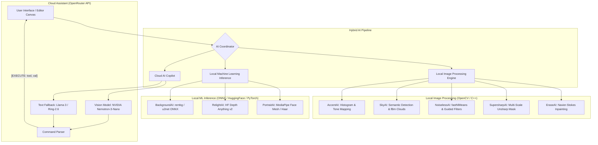

# AI Photo Editor Pro 🎨✨

**A Professional-Grade, Museum-Quality AI Photo Editor with Offline Intelligence.**

AI Photo Editor Pro is a high-performance desktop application designed for professional photographers and digital artists. It combines traditional high-fidelity image processing with state-of-the-art AI models to provide a workflow comparable to Adobe Lightroom Classic, but with the power of modern AI automation.

---

## 🚀 Key Features

- **Museum-Quality Processing**: Advanced tone mapping, histogram management, and multi-scale sharpening.
- **AI Copilot**: An integrated AI assistant that analyzes your photos and suggests/executes edits using vision-based reasoning.
- **Hybrid AI Pipeline**:
  - **Local Inference**: Background removal (ONNX), Portrait retouching, and Noise reduction.
  - **Vision Intelligence**: Connected to NVIDIA Nemotron models via OpenRouter for complex image analysis.
- **Professional Tools**:
  - Multi-channel Tone Curves.
  - Live Histogram analysis.
  - 14+ Professional Filter Presets (Film Simulations & Color Grades).
- **Privacy First**: Process images locally without mandatory cloud uploads.

---

## 🏗️ System Architecture

The following diagram illustrates the hybrid pipeline that powers the editor:



---

## 🛠️ Technology Stack

- **Frontend**: Python with Qt (PyQt6/PySide6) for a native, responsive desktop experience.
- **Image Processing**: OpenCV, NumPy, and Scipy for low-latency operations.
- **AI/ML**: ONNX Runtime, HuggingFace Transformers, and OpenRouter API integration.
- **UI Design**: Modern "Glassmorphism" theme with dynamic micro-animations.

---

## 📦 Installation & Setup

1. **Clone the repository**:
   ```bash
   git clone https://github.com/shreyansh-programmer/AI-Photo-Editor-Pro.git
   cd AI-Photo-Editor-Pro
   ```

2. **Install dependencies**:
   ```bash
   pip install -r requirements.txt
   ```

3. **Run the application**:
   ```bash
   python main.py
   ```

---

## 🤝 Selling / License Note
This project is architected for scalability. The modular engine design allows for easy integration of new AI models and custom filters.

---
*Created by [shreyansh-programmer](https://github.com/shreyansh-programmer)*
